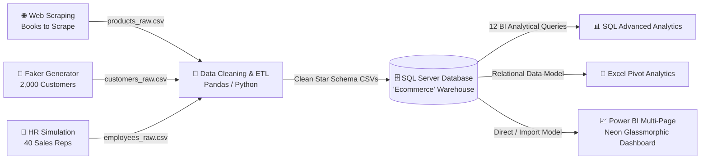

# 📚 E-Commerce End-to-End Data Analytics Pipeline & Executive BI Dashboard

[](https://www.python.org/)
[](https://www.microsoft.com/sql-server)
[](https://powerbi.microsoft.com/)
[](https://office.microsoft.com/excel)
[](https://pandas.pydata.org/)
[](https://opensource.org/licenses/MIT)

> **An enterprise-grade, end-to-end Data Analytics and Business Intelligence project** modeling an international online bookstore. The pipeline covers the full data lifecycle: **Web Scraping $\rightarrow$ Synthetic Data Simulation $\rightarrow$ Data Cleaning & ETL $\rightarrow$ Relational Data Warehousing (Star Schema) $\rightarrow$ SQL Business Intelligence $\rightarrow$ Excel Pivots $\rightarrow$ Interactive 3-Page Dark-Mode Glassmorphism Power BI Dashboard**.

---

## 🏗️ Architecture & Data Pipeline



---

## 🎯 Business Context & Objectives

A fast-growing multi-channel e-commerce bookstore needed a unified single source of truth to evaluate sales velocity, customer demographics, employee commission structures, and inventory turnover.

### Key Questions Answered:
1. **Executive Performance:** What is the historical revenue growth, Average Order Value (AOV), and customer acquisition trajectory?
2. **Sales Team Optimization:** Who are the top 10 revenue-generating representatives, and is commission allocation directly driving sales performance?
3. **Product & Inventory Health:** Which book genres generate high margin vs. volume, and which titles require immediate replenishment?
4. **Customer Intelligence:** What is the RFM (Recency, Frequency, Monetary) breakdown and geographic concentration of active customers?

---

## 🗄️ Relational Data Model (Star Schema)

The database is built on **SQL Server (`Ecommerce`)** using a normalized Star Schema architecture:

```
                  ┌──────────────────────────────┐
                  │     Dim_Customers            │
                  ├──────────────────────────────┤
                  │ CustomerID (PK)              │
                  │ FullName, Email, Gender      │
                  │ Country, Phone, RegDate      │
                  └──────────────┬───────────────┘
                                 │ 1
                                 │
                                 │ ∞
┌──────────────────────────────┐ │     ┌──────────────────────────────┐
│     Dim_Products             │ │     │     Dim_Employees            │
├──────────────────────────────┤ │     ├──────────────────────────────┤
│ ProductID (PK)               │ │     │ EmployeeID (PK)              │
│ ProductName, Category        │ │     │ FullName, Department         │
│ Price, Rating, StockQuantity │ │     │ BaseSalary, CommissionRate   │
└──────────────┬───────────────┘ │     │ PerformanceRating            │
               │ 1               │     └──────────────┬───────────────┘
               │                 │                    │ 1
               │ ∞               │ ∞                  │ ∞
             ┌─┴─────────────────┴────────────────────┴─┐
             │               Fact_Orders                │
             ├──────────────────────────────────────────┤
             │ OrderID (PK)                             │
             │ CustomerID (FK)                          │
             │ ProductID (FK)                           │
             │ EmployeeID (FK)                          │
             │ OrderDate, Quantity, TotalAmount         │
             └──────────────────────────────────────────┘
```

### Dataset Scale:
* **`Fact_Orders`:** 12,500 validated order transactions across 2023–2024.
* **`Dim_Customers`:** 2,000 international customers with verified phone and email domains.
* **`Dim_Employees`:** 40 sales representatives across multiple business units.
* **`Dim_Products`:** 50 catalog titles with scraped ratings, prices, and stock counts.

---

## 🛠️ Technology Stack & Methodologies

| Stage | Technology | Responsibilities |
| :--- | :--- | :--- |
| **Web Scraping** | Python (`BeautifulSoup`, `requests`) | Dynamic pagination scraping, rate limiting, and extraction of product features. |
| **Synthetic Simulation** | Python (`Faker`, `NumPy`) | Reproducible generation of realistic customers, transaction timestamps, and employee KPIs. |
| **Data Cleaning / ETL** | Python (`Pandas`) | Regex data type conversion, date handling, handling missing records, feature engineering. |
| **Data Warehousing** | Microsoft SQL Server (T-SQL) | Schema DDL, Primary/Foreign Key constraints, indexed Views, database backups. |
| **Business Analytics** | T-SQL | Window Functions (`LAG`, `LEAD`, `DENSE_RANK`), CTEs, RFM Scoring, MoM Calculations. |
| **Spreadsheet Modeling**| Microsoft Excel | Multi-sheet data linking, Pivot Tables, calculated fields, slicer panels. |
| **Data Visualization** | Microsoft Power BI | DAX measures, Star Schema modeling, custom neon glassmorphic UI design. |

---

## 💡 Key SQL Business Queries (`Analysis_Queries.sql`)

The repository includes **12 enterprise SQL queries**. Highlights include:

<details>
<summary><b>1️⃣ Executive KPIs & Financial Snapshot</b></summary>

```sql
SELECT 
    COUNT(DISTINCT o.OrderID) AS TotalOrders,
    COUNT(DISTINCT o.CustomerID) AS ActiveCustomersCount,
    SUM(o.Quantity) AS TotalUnitsSold,
    FORMAT(SUM(o.TotalAmount), 'C', 'en-US') AS TotalRevenue,
    FORMAT(AVG(o.TotalAmount), 'C', 'en-US') AS AverageOrderValue,
    COUNT(DISTINCT o.EmployeeID) AS ActiveSalesRepsCount
FROM dbo.Orders o;
```
</details>

<details>
<summary><b>2️⃣ Month-over-Month (MoM) Growth Analysis with LAG()</b></summary>

```sql
WITH MonthlySales AS (
    SELECT 
        YEAR(OrderDate) AS OrderYear,
        MONTH(OrderDate) AS OrderMonth,
        SUM(TotalAmount) AS CurrentMonthRevenue
    FROM dbo.Orders
    GROUP BY YEAR(OrderDate), MONTH(OrderDate)
)
SELECT 
    OrderYear,
    OrderMonth,
    FORMAT(CurrentMonthRevenue, 'C', 'en-US') AS CurrentRevenue,
    FORMAT(LAG(CurrentMonthRevenue) OVER (ORDER BY OrderYear, OrderMonth), 'C', 'en-US') AS PreviousMonthRevenue,
    FORMAT(((CurrentMonthRevenue - LAG(CurrentMonthRevenue) OVER (ORDER BY OrderYear, OrderMonth)) / 
            NULLIF(LAG(CurrentMonthRevenue) OVER (ORDER BY OrderYear, OrderMonth), 0)), 'P2') AS MoM_Growth_Rate
FROM MonthlySales;
```
</details>

<details>
<summary><b>3️⃣ Customer RFM Segmentation Matrix</b></summary>

```sql
WITH RFM_Raw AS (
    SELECT 
        c.CustomerID,
        c.FullName,
        DATEDIFF(DAY, MAX(o.OrderDate), '2024-12-31') AS Recency_Days,
        COUNT(DISTINCT o.OrderID) AS Frequency_Orders,
        SUM(o.TotalAmount) AS Monetary_Spend
    FROM dbo.Customers c
    JOIN dbo.Orders o ON c.CustomerID = o.CustomerID
    GROUP BY c.CustomerID, c.FullName
)
SELECT 
    CustomerID,
    FullName,
    Recency_Days,
    Frequency_Orders,
    FORMAT(Monetary_Spend, 'C', 'en-US') AS TotalSpend,
    NTILE(5) OVER (ORDER BY Recency_Days DESC) AS R_Score,
    NTILE(5) OVER (ORDER BY Frequency_Orders ASC) AS F_Score,
    NTILE(5) OVER (ORDER BY Monetary_Spend ASC) AS M_Score
FROM RFM_Raw;
```
</details>

---

## 📊 Power BI Dashboard Architecture (3-Page Report)

Designed with a high-contrast **Dark Mode & Neon Glassmorphism UI**, the report is structured into 3 interactive pages:

```
┌─────────────────────────────────────────────────────────────────────────────┐
│ 🌟 PAGE 1: EXECUTIVE SALES OVERVIEW                                         │
│ • Slicers: Year, Quarter, Book Category                                     │
│ • KPI Cards: Total Revenue, Total Orders, Average Order Value, Active Users │
│ • Visuals: Monthly Sales vs SPLY, Top Categories, Revenue by Gender, Geog.  │
├─────────────────────────────────────────────────────────────────────────────┤
│ 👔 PAGE 2: SALES TEAM & REPS PERFORMANCE                                    │
│ • Slicers: Department, Performance Rating, Sales Rep                        │
│ • KPI Cards: Total Reps (40), Total Commission, Avg Rev/Rep, Sales/Salary   │
│ • Visuals: Top 10 Reps Leaderboard, Rev by Department, Matrix with Data Bars│
├─────────────────────────────────────────────────────────────────────────────┤
│ 📦 PAGE 3: PRODUCTS & INVENTORY HEALTH                                      │
│ • Slicers: Category, Rating (Stars), Stock Status                           │
│ • KPI Cards: Total Books (50), Avg Price, Avg Rating, Low Stock Count       │
│ • Visuals: Product Matrix, Stock Availability by Genre, Rating vs Sales     │
└─────────────────────────────────────────────────────────────────────────────┘
```

---

## 📁 Repository Structure

```plaintext
├── scraper.py                 # BeautifulSoup Web Scraper for book data
├── GenerateFaker.py           # Synthetic Customer Generator (2,000 records)
├── GenerateEmployees.py       # HR Employee & Performance Generator (40 records)
├── Cleaning.ipynb             # Jupyter Notebook for Data Cleaning & Feature Engineering
├── Analysis_Queries.sql       # 12 Verified Business Intelligence T-SQL Queries
├── Ecommerce_Database.xlsx    # Clean Excel Database with Pivot Table Analytics
├── products_cleaned.csv       # Production-ready Products dimension
├── customers_cleaned.csv      # Production-ready Customers dimension
├── employees_cleaned.csv      # Production-ready Employees dimension
├── orders.csv                 # Production-ready Orders fact table
├── Ecommerce_Master.csv       # Master Denormalized View export
├── Ecommerce_Backup.bak       # Complete SQL Server Database Backup
└── README.md                  # Project Documentation
```

---

## 🚀 Getting Started & Replication

### 1. Clone the Repository
```bash
git clone https://github.com/yourusername/ecommerce-data-analytics-pipeline.git
cd ecommerce-data-analytics-pipeline
```

### 2. Set Up Python Environment & Run Pipelines
```bash
pip install pandas numpy requests beautifulsoup4 faker openpyxl sqlalchemy pyodbc
python scraper.py
python GenerateFaker.py
python GenerateEmployees.py
```

### 3. Restore SQL Server Database
1. Open **SQL Server Management Studio (SSMS)**.
2. Right-click **Databases** $\rightarrow$ **Restore Database...**
3. Select Device $\rightarrow$ Choose [`Ecommerce_Backup.bak`](file:///e:/tik%20tok/Data%20Science/Ecommerce_Backup.bak) $\rightarrow$ Click **OK**.
4. Open and execute [`Analysis_Queries.sql`](file:///e:/tik%20tok/Data%20Science/Analysis_Queries.sql) to run analytical reports.

### 4. Open Power BI Dashboard
* Load the Power BI Desktop file (`.pbix`) and point data source credentials to your local SQL Server instance or load the clean CSV files directly.

